<!-- Contributors: Claude (drafted this page and its diagrams from the README, the Scrum Board and the issue descriptions). -->

How PolySocial is built, as we currently envision it. The page follows the [Android App Architecture guide](https://developer.android.com/topic/architecture/intro): a **UI layer** (Compose screens and ViewModels), a **domain layer** of pure Kotlin logic, and a **data layer** of repositories in front of Firebase, Google Maps, Nominatim and the device sensors.

This diagram is meant to **stay ahead of the code and drive development**. When a sprint task changes the design, update this page in the same PR. The Markdown source is versioned in the repository at `docs/Architecture-Diagram.md`, and this wiki page mirrors it.

## Contents

1. [Legend](#legend)
2. [Architecture overview](#1-architecture-overview)
3. [Navigation map](#2-navigation-map)
4. [Feature slices](#3-feature-slices)
5. [Key flows](#4-key-flows)
6. [Data model](#5-data-model)
7. [Security Rules](#6-security-rules)
8. [Offline behaviour](#7-offline-behaviour)
9. [Testability](#8-testability)
10. [Proposed package layout](#9-proposed-package-layout)
11. [Backlog traceability](#10-backlog-traceability)
12. [Open design questions](#11-open-design-questions)

## Legend

| Colour | Meaning |
|---|---|
| 🟩 Green | In the **Sprint 1 backlog**. Names and methods come from the issue descriptions. |
| 🟦 Blue | In the **Product Backlog**. Planned, and the names are proposals until an issue fixes them. |
| ⬜ Grey, dashed | **Later or undecided**. Needs a team decision or its own issue first. |
| 🟨 Yellow | **External service or device API**. |

Arrows read "uses" or "calls". A dashed arrow is a planned or optional dependency.

**Dependency rule.** Screens talk only to their ViewModel. ViewModels talk to repositories and to domain logic. Only repository implementations import Firebase, the Maps SDK, HTTP or location APIs. The domain layer imports nothing from Android or Firebase.

## 1. Architecture overview


The source is `images/architecture-overview.svg`, a plain SVG kept next to the PNG. Edit it in any vector editor (or as text), then export the PNG again.

**Which screen uses what.** The same relations as the arrows above, as a table:

| Feature (ViewModel) | Domain logic | Repositories and services |
|---|---|---|
| 🟩 Authentication (`AuthViewModel`) | EPFL email check | `AuthRepository`, `UserProfileRepository` |
| 🟩 App shell | — | — (navigation state only) |
| 🟩 Create Event (`CreateEventViewModel`) | event validation | `UserProfileRepository` (verified-association badge), `EventRepository`, `GeocodingRepository` later |
| 🟩 Map tab (`MapViewModel`) | haversine distance | `EventRepository`, `LocationService`; renders with the Google Maps SDK |
| 🟦 Events tab (`EventsViewModel`, `EventDetailViewModel`) | event filtering | `EventRepository`, `ReminderScheduler` |
| 🟦 Groups and matching (`MatchingViewModel`) | group matching | `MatchRepository`, `GroupRepository` |
| 🟦 Chats tab (`ChatViewModel`) | — | `ChatRepository` |
| 🟦 At the venue (`CheckInViewModel`, `AlbumViewModel`) | check-in policy, QR parsing, image resize | `GroupRepository`, `LocationService`, `QrScanner`, `PhotoRepository` |
| 🟦 Profile tab (`ProfileViewModel`, `FriendsViewModel`) | QR parsing | `UserProfileRepository`, `FriendRepository`, `QrScanner`, `AuthRepository` (log out, delete account) |

**How to read it.**
- Every screen has exactly one ViewModel. The ViewModel exposes a single immutable UI-state `StateFlow` with loading, empty, success and error variants, and receives user actions as function calls.
- Repositories are Kotlin interfaces with a Firebase (or device) implementation and a `Fake…` implementation for tests. ViewModels get them through their constructor.
- Firestore offline persistence is the only cache. There is no Room database and no custom sync layer (see [Offline behaviour](#7-offline-behaviour)).
- The Google Maps SDK is a UI component. `MapScreen` renders markers from `MapViewModel` state and never queries data itself.

## 2. Navigation map

App-start routing (#32) decides between the authentication flow and the main app. The main app is a four-tab shell (#41). Each tab has its own back stack (#42) and starts in the shared loading or placeholder state (#43).

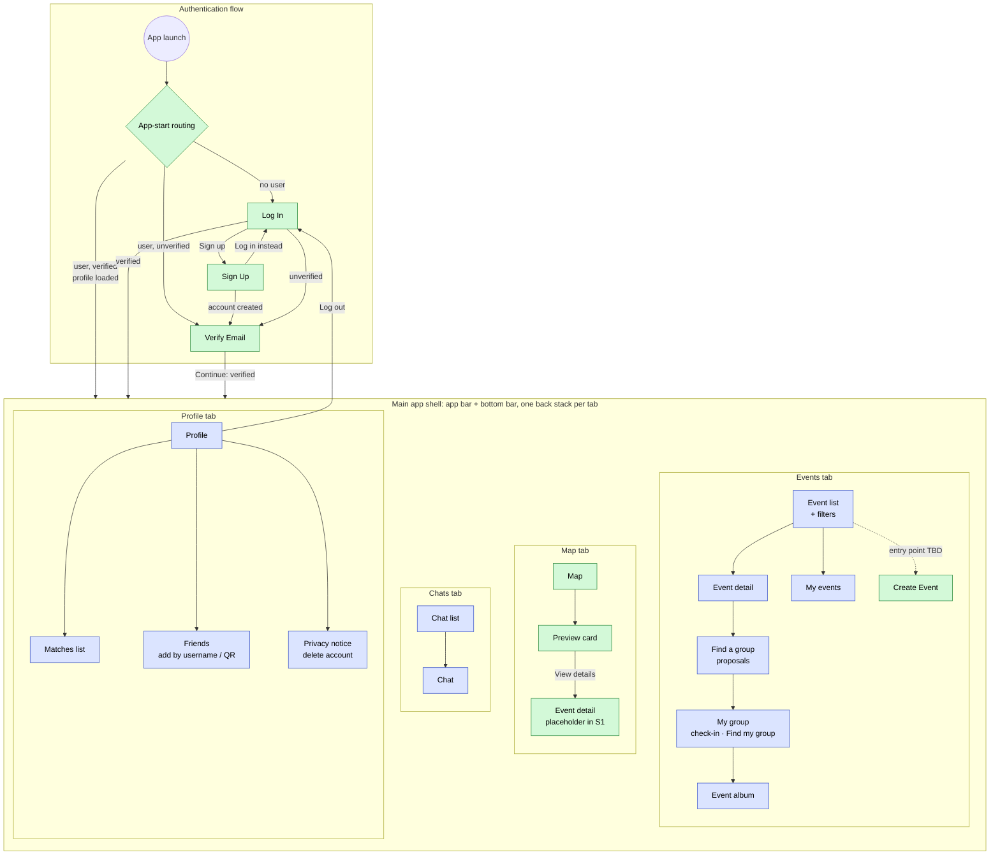

Notes:
- **Back behaviour (#39, #42).** Back pops the current tab's stack first. At a tab root it returns to the previously visited tab. It exits the app only at the true initial state. Switching tabs restores each tab's screen and scroll position (#38).
- **Create Event.** The issues don't say where the entry point is (see [open question 5](#11-open-design-questions)). After success it navigates back (#46).
- **Event detail.** Until the real screen exists, the Map tab's "View details" opens a placeholder route (#50).

## 3. Feature slices

### 3.1 Authentication and user profile (Sprint 1)

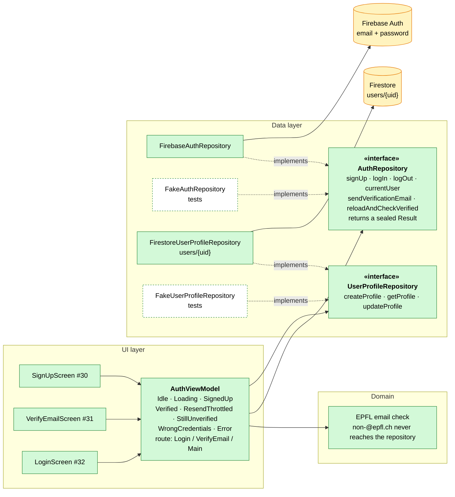

- **Result types (#30–#32).** `signUp` returns success, invalid domain, already in use or network error. `logIn` adds wrong credentials. `sendVerificationEmail` has a distinct *throttled* failure for Firebase's too-many-requests error, which the UI shows differently from a real error.
- **Profile (#34).** `UserProfile` has at least `uid`, `email` and `createdAt`. #45 adds `isAssociation` and `isAssociationVerified`, both defaulting to `false`. The document ID is always the Auth UID, never a client-generated ID. The profile is created **exactly once, at the first verified entry** (Verify Email "Continue", or app-start routing finding a verified user without a profile), because the Security Rules only allow writes from verified accounts. If account creation fails, no profile is written. If the profile write fails, the user sees an error state. Fields other students may see live in a separate `publicProfiles/{uid}` document (see [5.2](#52-collections-and-key-fields)).
- **Log out (#8, #32).** Logging out clears the session, and the next launch routes to Log In.

### 3.2 Event creation, discovery and map (Sprint 1)

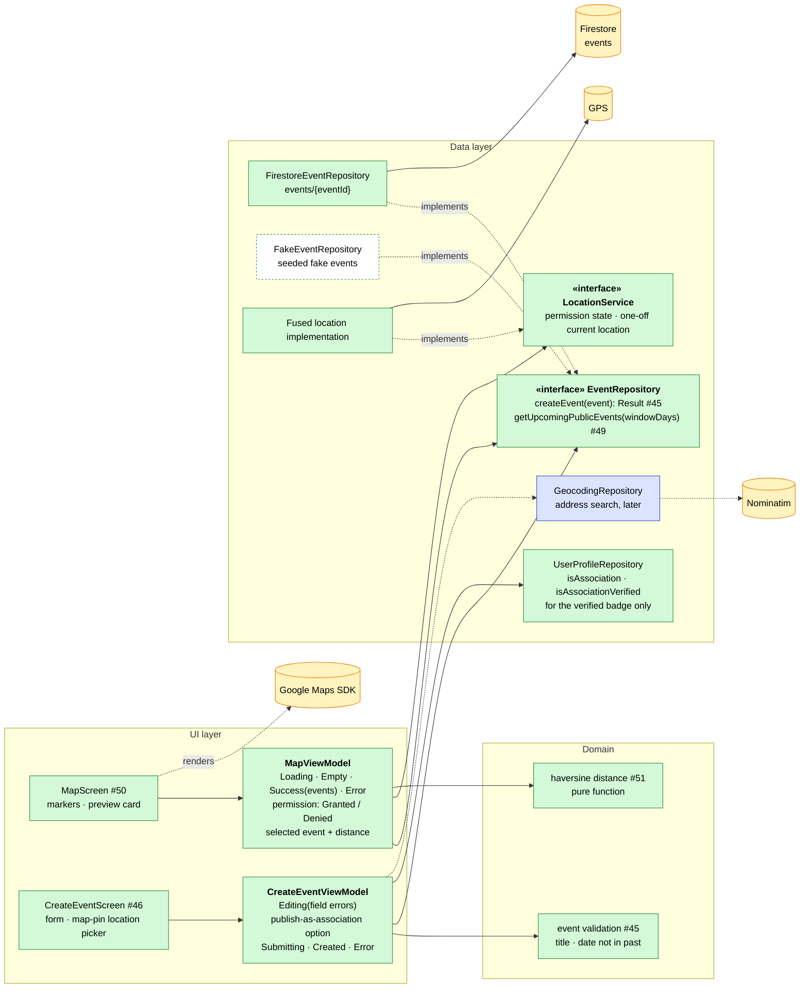

- **Event model (#45).** `id`, `title`, `description`, `category`, `location` (lat/lng), `startTime`, `capacity` (nullable), `isPrivate`, `createdBy`, `organizerIds`, `allowedUids` and `isAssociationEvent`. `createdBy` is always the authenticated UID and is always in `organizerIds` and `allowedUids`. The Security Rules enforce this again (#47).
- **Map (#50, #51).** The map is centred on Lausanne. Location permission is requested once, on first entry to the Map tab. If it's denied, the map stays fully usable without distance badges. Distance is labelled *straight-line*, not walking time. Directions is a billed SKU and out of scope.
- **Upcoming events query (#49).** The query **must** include `isPrivate == false`. Security Rules are not filters, so a query that could return a private event is rejected as a whole. Combining equality on `isPrivate` with a range on `startTime` needs a composite index, which should be versioned in `firestore.indexes.json` next to the rules.
- **Create Event access (#46).** **Anyone can create an event** and becomes its **organizer**. An event can have one or several student organizers (`organizerIds`). Only a verified association (`isAssociation && isAssociationVerified`) sees the "publish as <association>" option, which sets `isAssociationEvent` and shows a verified badge. Nominatim address search appears in the Figma task (#44), but the Sprint 1 build task only requires a map pin (#46), so geocoding stays blue. When added, it must follow the Nominatim policy: custom User-Agent, at most 1 request per second, debounced and cached, explicit search only (no search-as-you-type), and OSM attribution in the UI.

### 3.3 Groups, matching and chat (Product Backlog)

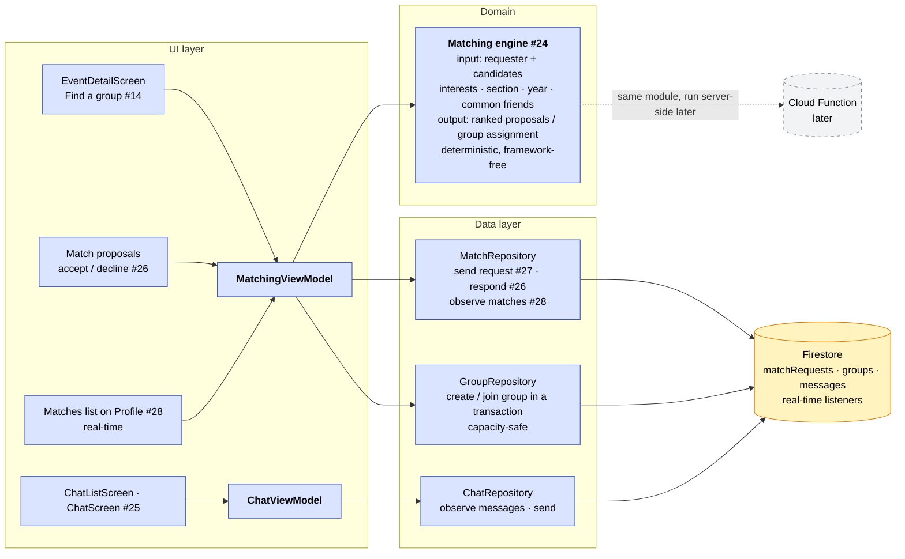

- **Matching starts on the client.** Following the risk plan, matching starts as a simple deterministic heuristic in a pure Kotlin module and runs on the client. Group creation and joining go through a **Firestore transaction**, so two students can't take the last spot at the same time. If it later moves to a Cloud Function, the module moves unchanged. Only the caller changes.
- **Real-time screens.** The matches list (#28) and chat (#25) use Firestore snapshot listeners exposed as `Flow`.
- **Chat type.** Each group gets a group chat. One-to-one chats between friends or matches use the same message model (see [open question 12](#11-open-design-questions)).
- **Moderation-ready.** Messages carry `senderId` and `createdAt`, and the rules are written per operation, so report/block and rate limiting can be added later without a rule rewrite.

### 3.4 At the venue and social features (Product Backlog)

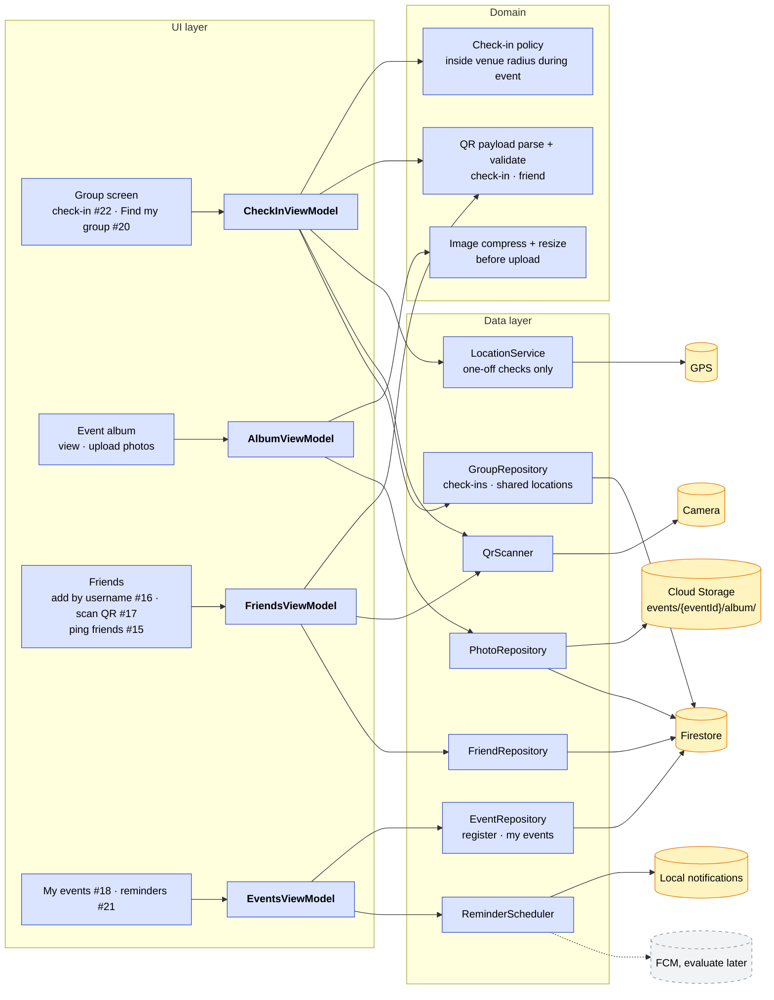

- **Check-in (#22).** A one-off location check against the venue during the event window. A QR code at the entrance is the indoor fallback. Only checked-in members can upload to the album (README).
- **Find my group (#20).** Locations are shared **only with the group and only during the event** (README). This is the only feature that shares location with other users, so its storage and deletion need a team decision first (see [open question 7](#11-open-design-questions)). There is no location history.
- **Album.** Photos are compressed and resized on the device, then stored in Cloud Storage. A Firestore document holds each photo's metadata. Storage Security Rules enforce size and type limits and check-in membership. Thumbnails are cached.
- **Reminders (#21, #36).** Reminders are scheduled locally when the student registers, so they fire without a network.

## 4. Key flows

Each flow shows who calls whom, top to bottom. "App" is the screen together with its ViewModel.

### 4.1 Sign up (#30)

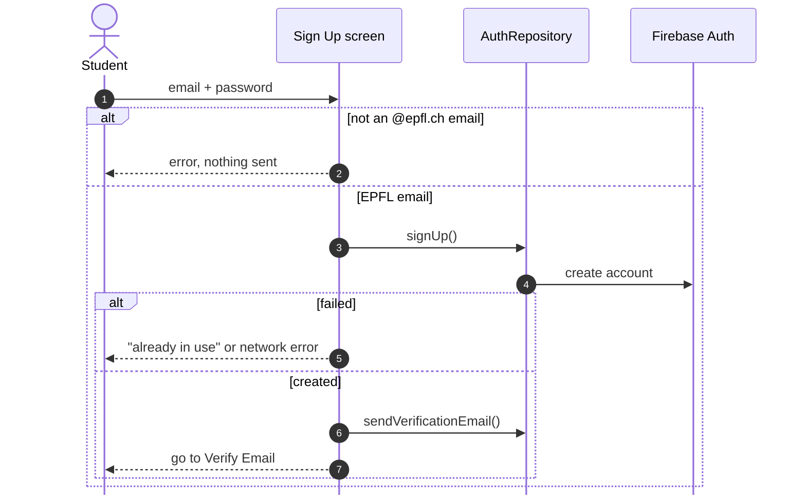

No profile is written yet. The Security Rules only accept writes from verified accounts.

### 4.2 Verify email, then create the profile (#31, #34)

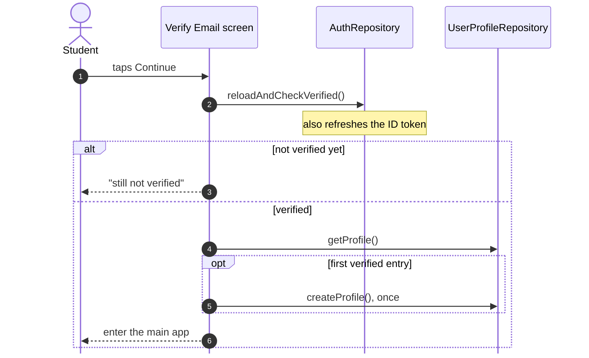

### 4.3 App start routing (#32)

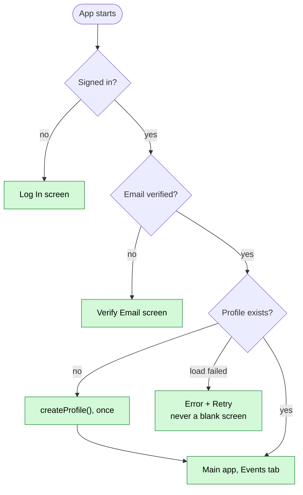

### 4.4 Map: public events and distances (#49–#51)

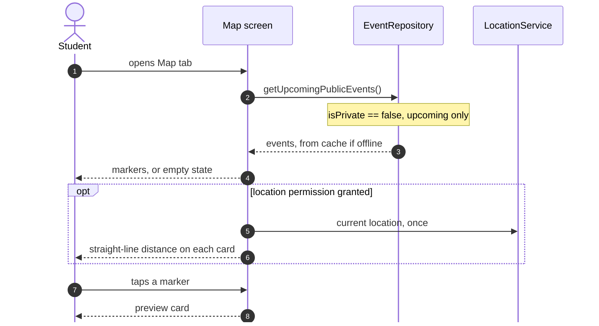

### 4.5 Find a group (Product Backlog, proposal)

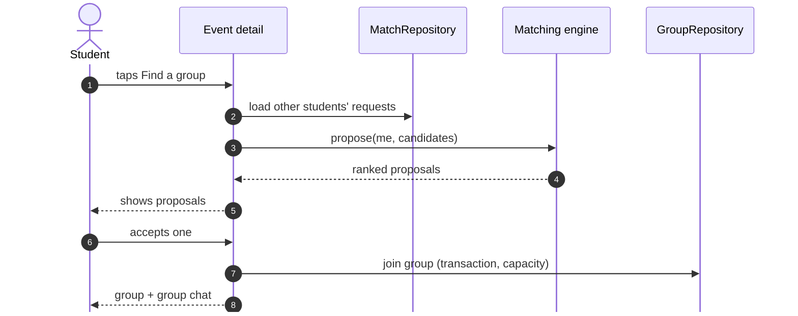

## 5. Data model

### 5.1 How the collections relate

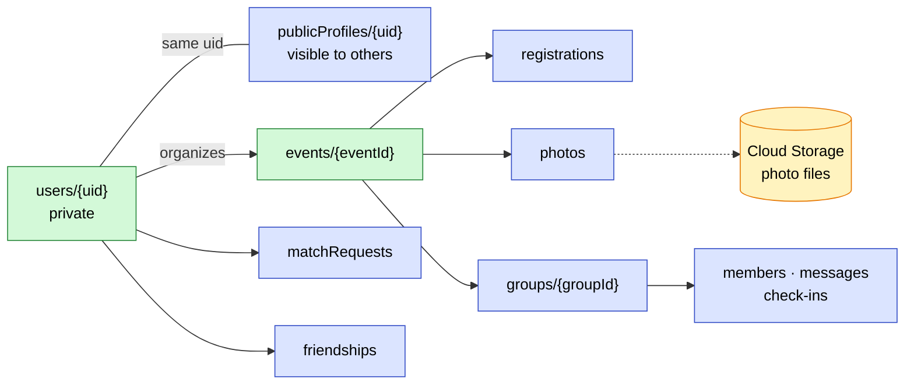

### 5.2 Collections and key fields

| Collection | Key fields | Status |
|---|---|---|
| `users/{uid}` | `uid`, `email`, `createdAt`, `isAssociation`, `isAssociationVerified` | 🟩 #34, #45 |
| `events/{eventId}` | `title`, `description`, `category`, `location`, `startTime`, `capacity?`, `isPrivate`, `createdBy`, `organizerIds`, `allowedUids`, `isAssociationEvent` | 🟩 #45 |
| `publicProfiles/{uid}` | `username`, `displayName`, `section`, `year`, `interests` (always visible), `visibility` (public or private), `bio` | 🟦 new issue |
| `events/{id}/registrations/{uid}` | `registeredAt` | 🟦 #18 |
| `matchRequests/{id}` | `eventId`, `fromUid`, `toUid`, `status` | 🟦 #26, #27 |
| `groups/{groupId}` + `members`, `messages`, `checkIns` | `eventId`, `capacity` · `senderId`, `text`, `createdAt` · `method` (gps or qr) | 🟦 #14, #22, #25 |
| `friendships/{id}` | `uidA`, `uidB`, `status` | 🟦 #16 |
| `events/{id}/photos/{photoId}` | `storagePath`, `uploaderId`, `createdAt`. The file itself is in Cloud Storage. | 🟦 album |

**Profiles are split, Instagram-style.** `users/{uid}` is private to its owner. `publicProfiles/{uid}` is what other students see. Section, year and interests are always visible because matching needs them. A **public** profile also shows friends, events attended, photos and the full bio to everyone. A **private** profile shows those only to approved connections.

## 6. Security Rules

Rules live in `firebase/firestore/firestore.rules` and are tested against the Firebase Local Emulator Suite. **Today** the file allows any signed-in user to read and write everything. Sprint 1 replaces that.

| Collection | Read | Create | Update / delete | Issue | Status |
|---|---|---|---|---|---|
| *every rule* | requires `isEpflUser()`: signed in, `email_verified == true`, email ends with `@epfl.ch` | | | #33 | 🟩 S1 |
| `users/{uid}` | own document only | own document only | own document only | #35 | 🟩 S1 |
| `events/{id}`, public | any EPFL user | any EPFL user, `createdBy == auth.uid` and in `organizerIds`. `isAssociationEvent` only for a verified association | organizers only | #47, #52 | 🟩 S1 |
| `events/{id}`, private | `auth.uid in allowedUids` (organizers, members, approved match requesters) | as above | organizers only | #52, #23 | 🟩 S1 |
| `publicProfiles/{uid}` | any EPFL user. Fields beyond the public set only for public profiles or approved connections | owner only | owner only | new issue | 🟦 PB |
| `groups/**`, `messages` | group members only | members, rate-limit ready | sender only | #25 | 🟦 PB |
| `matchRequests` | sender and recipient | sender | recipient responds | #26, #27 | 🟦 PB |
| Storage `events/{id}/album/**` | event group members | checked-in members, size and type limits | uploader | album | 🟦 PB |

Every PR that changes rules follows the process in `AGENTS.md`: "Changes Security Rules" in the description, allowed and denied emulator tests, and explicit reviewer sign-off.

## 7. Offline behaviour

| Works offline | How |
|---|---|
| Events already loaded, registered events and their schedule (#36) | Firestore offline persistence serves cached documents |
| Event reminders (#21) | scheduled locally on the device at registration |
| Map | shows cached events on whatever tiles the Maps SDK already cached. **No tile prefetching or offline tile storage.** |
| Writes such as chat messages and registrations | queued by Firestore and synced on reconnect, with a pending indicator in the UI |

Sign up, log in and verification need a network, and their screens show a clear network-error state. Every ViewModel exposes an error or offline state instead of failing silently.

## 8. Testability

| Seam | Production implementation | Test double | Tested by |
|---|---|---|---|
| `AuthRepository` | `FirebaseAuthRepository` | `FakeAuthRepository` | ViewModel unit tests, UI tests |
| `UserProfileRepository` | `FirestoreUserProfileRepository` | `FakeUserProfileRepository` | ViewModel unit tests, UI tests |
| `EventRepository` | `FirestoreEventRepository` | `FakeEventRepository` (seeded) | ViewModel unit tests, UI tests |
| `LocationService` | fused-location implementation | fake fixed location / denied | Map UI tests (CI emulators have no GPS fix) |
| `QrScanner`, camera | camera implementation | fake payloads | UI tests (CI emulators have no camera) |
| Domain functions | — | none needed | plain JVM unit tests |
| Firestore and Storage rules | — | Firebase Local Emulator Suite | rules tests |
| Nominatim client | HTTP client | canned JSON / MockWebServer | unit tests, never live calls |

## 9. Proposed package layout

The codebase currently only contains the template (`MainActivity`, `SecondActivity`, `SimpleData.kt`, `ui/theme`, `resources/C.kt`). This is the proposed target structure. The first sprint tasks will confirm it.

```
com.polysocial
├── MainActivity.kt          entry point, hosts the NavHost
├── ui/
│   ├── navigation/          routes, bottom bar, app bar, per-tab back stacks   (#41, #42)
│   ├── common/              shared LoadingState / EmptyState                    (#43)
│   ├── auth/                SignUp, VerifyEmail, Login screens + AuthViewModel  (#30–#32)
│   ├── map/                 MapScreen + MapViewModel                            (#50, #51)
│   ├── event/               CreateEvent, event list and detail + ViewModels     (#46)
│   └── theme/               exists
├── model/                   data layer: data classes, repository interfaces and implementations
│   ├── auth/                AuthRepository, FirebaseAuthRepository              (#30)
│   ├── user/                UserProfile, UserProfileRepository, Firestore impl  (#34, #45)
│   ├── event/               Event, EventRepository, FirestoreEventRepository    (#45, #49)
│   └── location/            LocationService + implementation                    (#51)
├── domain/                  pure Kotlin: validation, distance, filtering, matching, QR parsing
└── resources/C.kt           test tags, exists
```

Fakes live in the test source sets (`app/src/test/` and `app/src/androidTest/`).

## 10. Backlog traceability

Every Scrum Board item mapped to the components it touches.

| Item | Epic | Components | Status |
|---|---|---|---|
| #6 Sign up, #5 | Authentication | Sign Up screen, AuthViewModel, AuthRepository, email validation | 🟩 via #29, #30, #33 |
| #7 Log in | Authentication | Log In screen, app-start routing, AuthRepository | 🟩 via #29, #32 |
| #8 Log out | Authentication | Profile tab, AuthRepository.logOut | 🟦 (logOut built in #32) |
| #9 Data binding | Authentication | UserProfileRepository, `users/{uid}`, rules | 🟩 via #34, #35 |
| #37 Bottom navigation | App Shell | navigation, app bar | 🟩 via #41 |
| #38 Scroll position kept | App Shell | per-tab back stacks | 🟩 via #42 |
| #39 Back navigation | App Shell | per-tab back stacks | 🟩 via #42 |
| #40 Placeholder state | App Shell | shared Loading / Empty state | 🟩 via #43 |
| #12 Event creation | Event Creation | Create Event screen, CreateEventViewModel, EventRepository.createEvent, rules | 🟩 via #44–#47 |
| #10 Browse events, #11 | Event Discovery | Map tab, MapViewModel, getUpcomingPublicEvents, LocationService, distance | 🟩 via #48–#51 |
| #23 Hide private events | Event Discovery | `isPrivate`, query filter, events read rule | 🟩 via #49, #52 |
| #13 Filter events | Event Discovery | Events tab, event filtering (domain) | 🟦 |
| #18 List of chosen events | — | My events, registrations, EventRepository | 🟦 |
| #36 Offline registered events | — | Firestore offline cache, My events | 🟦 |
| #19 Section-exclusive event | — | Event audience field, profile `section`, read rule | ⬜ |
| #14 Group for an event | Groups & Matchmaking | Find a group, MatchingViewModel, matching engine, GroupRepository | 🟦 |
| #24 Match students together | Groups & Matchmaking | matching engine (domain) | 🟦 |
| #26 Accept or decline match | Groups & Matchmaking | proposals screen, MatchRepository | 🟦 |
| #27 Match with other students | Groups & Matchmaking | Match button, MatchRepository | 🟦 |
| #28 Real-time list of matches | Groups & Matchmaking | Profile matches list, snapshot listener | 🟦 |
| #15 Ping friends | Groups & Matchmaking | FriendRepository, notifications | ⬜ |
| #25 Chat | Chat | Chats tab, ChatViewModel, ChatRepository, `messages` | 🟦 |
| #16 Adding friends | — | Friends screen, FriendRepository, `username` | 🟦 |
| #17 Meeting people by QR | — | QrScanner, QR payload parsing, FriendRepository | 🟦 |
| #22 Automatic check-in | — | check-in policy, LocationService, QR fallback, GroupRepository | 🟦 |
| #20 Find my group | — | group venue map, shared locations | ⬜ |
| #21 Event notification | — | ReminderScheduler, local notifications | 🟦 |
| #1, #53, #55 | — | project setup, PR template, CI. No product architecture impact | — |

## 11. Open design questions

These came up while mapping the backlog onto the architecture. Each needs a team (or PO) decision, and the related issue should be updated once decided.

1. ✅ **Decided: profile creation timing.** The profile is created exactly once, at the first verified entry (Verify Email "Continue" or app-start routing when the profile is missing), so it passes the verified-email rule. Applied to #31, #32 and #34.
2. ✅ **Decided: anyone can create an event.** The creator becomes its organizer, and an event can have one or several student organizers. A verified association can publish an event under its name with a verified badge. Unverified associations act like normal students. Applied to #12, #44, #45, #46 and #47.
3. ✅ **Decided: public profile split, with public and private profiles.** `users/{uid}` stays private. `publicProfiles/{uid}` holds the fields others may see, and section, year and interests are always visible because matching needs them. Applied to #34 and #35, plus a new issue for public profiles.
4. ✅ **Decided: event access list.** Events carry `allowedUids`, and the private-event read rule checks `request.auth.uid in resource.data.allowedUids`. Applied to #45 and #52.
5. **Create Event entry point** and the "My events" destination after creation (#46).
6. **Where matching runs and how it stays consistent.** Client-side with transactions now, Cloud Function later. When do we switch?
7. **Find my group location sharing (#20).** Proposal: an ephemeral `groups/{groupId}/locations/{uid}` document, written only during the event window, deleted at the end, and readable only by group members. Needs a privacy notice update.
8. **Reminders mechanism (#21).** Local scheduling (WorkManager or AlarmManager) and the Android 13+ notification permission. FCM is evaluated only when notifications enter the backlog.
9. **QR codes (#17, #22).** The decoding library and the payload format (what a check-in QR and a friend QR contain, and how they are signed or validated).
10. **Section-exclusive events (#19).** Needs a `section` profile field and an audience field on events, enforced in rules.
11. **Association verification flow.** #45 notes it is only settable through fixtures for now. A follow-up issue is needed.
12. **Chat shape (#25).** Is a one-to-one chat a two-member group, or a separate collection?
13. **Dependency injection.** **Recommendation:** constructor injection with a small hand-written provider object, unless the team chooses a library.
