<!-- Contributors: Claude (drafted this page and its diagrams from the README, the Scrum Board and the issue descriptions; association accounts without an EPFL email; Create Event design update, #44; ViewModel rule wording; Security Rules state after #35; association badge from the profile, #45). -->

How PolySocial is built, as we currently envision it. The page follows the [Android App Architecture guide](https://developer.android.com/topic/architecture/intro): a **UI layer** (Compose screens and ViewModels), a **domain layer** of pure Kotlin logic, and a **data layer** of repositories in front of Firebase, the map and geocoding services, and the device sensors.

This diagram is meant to **stay ahead of the code and drive development**. When a sprint task changes the design, update this page in the same PR. The Markdown source is versioned in the repository at `docs/Architecture-Diagram.md`, and this wiki page mirrors it.

## Contents

1. [Architecture overview](#1-architecture-overview)
2. [Navigation map](#2-navigation-map)
3. [Feature slices](#3-feature-slices)
4. [Key flows](#4-key-flows)
5. [Data model](#5-data-model)
6. [Security Rules](#6-security-rules)
7. [Design decisions](#7-design-decisions)
8. [Backlog traceability](#8-backlog-traceability)

## Legend

| Colour | Meaning |
|---|---|
| 🟩 Green | In the **Sprint 1 backlog**. Names and methods come from the issue descriptions. |
| 🟦 Blue | In the **Product Backlog**. Planned, and the names are proposals until an issue fixes them. |
| ⬜ Grey, dashed | **Later or undecided**. Needs a team decision or its own issue first. |
| 🟨 Yellow | **External service or device API**. |

Arrows read "uses" or "calls". A dashed arrow is a planned or optional dependency.

**Dependency rule.** Screens talk only to their ViewModel. ViewModels talk to repositories and to domain logic. Only repository implementations import Firebase, the Maps SDK, HTTP or location APIs. The domain layer imports nothing from Android or Firebase.

## 1. Architecture overview

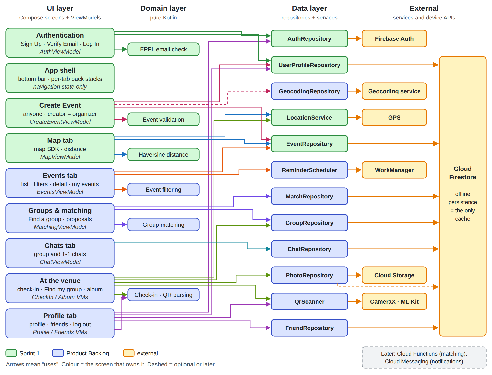

The source is `images/architecture-overview.svg`, a plain SVG kept next to the PNG. Edit it in any vector editor (or as text), then export the PNG again.

**How to read it.**
- Every screen that holds state has exactly one ViewModel. The app shell (app bar, bottom bar and `NavHost`, #41) has none: its only state is navigation, which the `NavController` owns, and a ViewModel copy of it could get out of sync. The ViewModel exposes a single immutable UI-state `StateFlow` with loading, empty, success and error variants, and receives user actions as function calls.
- Repositories are Kotlin interfaces with a Firebase (or device) implementation and a `Fake…` implementation for tests. ViewModels get them through their constructor, injected by **Hilt** (`@HiltViewModel`). Tests swap in the fakes with Hilt's test modules.
- **Offline:** Firestore offline persistence is the only cache (no Room, no custom sync). Loaded events, registered events and their schedule stay readable offline. Writes such as chat messages are queued and synced on reconnect. Reminders are scheduled on the device. The map shows cached events on tiles the Maps SDK already cached, with **no tile prefetching**. Sign-up and log-in need a network and show a clear error without one.
- **Map provider:** Google Maps today, but it may switch to Mapbox (recommended by the coaches). Either way the map SDK is a UI component, so switching only touches the Map screen. `MapScreen` renders markers from `MapViewModel` state and never queries data itself.

## 2. Navigation map

App-start routing (#32) decides between the authentication flow and the main app. The main app is a four-tab shell (#41). Each tab has its own back stack (#42) and starts in the shared loading or placeholder state (#43).

### 2.1 Signing in

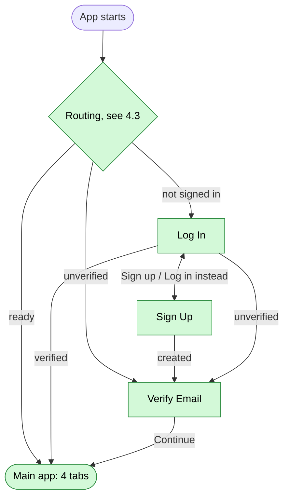

### 2.2 Main app (one back stack per tab)

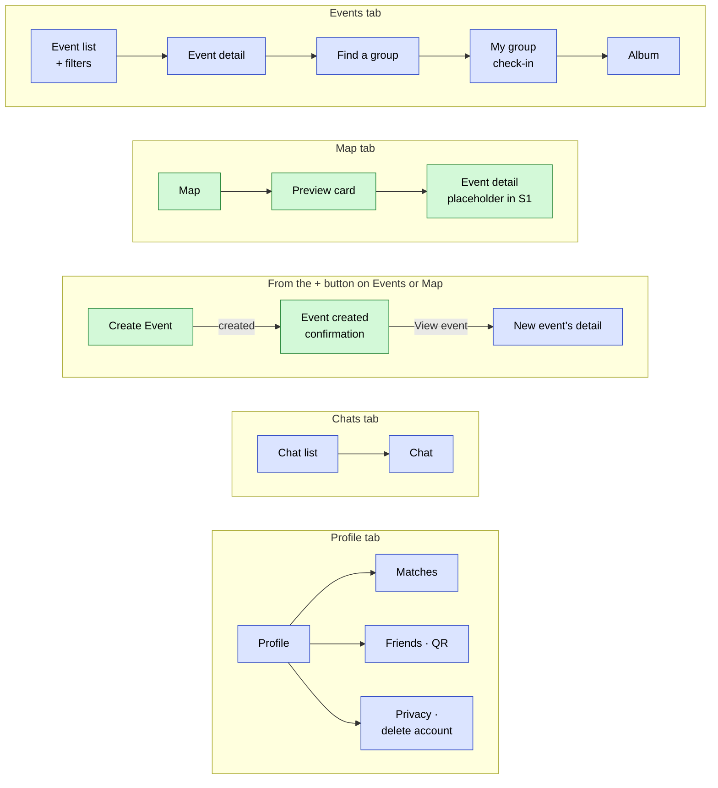

Notes:
- **Back behaviour (#39, #42).** Back pops the current tab's stack first. At the root of the Map, Chats or Profile tab it goes to the **Events** (home) tab, and at the Events root it exits the app. This is Android's standard bottom-navigation behaviour. Switching tabs restores each tab's screen and scroll position (#38).
- **Create Event.** A "+" button on the Events and Map tabs opens it. After creating, an "Event created" confirmation offers *View event* (the new event's detail) and *Back to map*, as in the Figma (#44).
- **Event detail.** Until the real screen exists, the Map tab's "View details" opens a placeholder route (#50).

## 3. Feature slices

Each Sprint 1 feature, from screen to data source. The Product Backlog features are already drawn in the [overview](#1-architecture-overview), so they are described in text only.

### 3.1 Authentication and profile (Sprint 1)

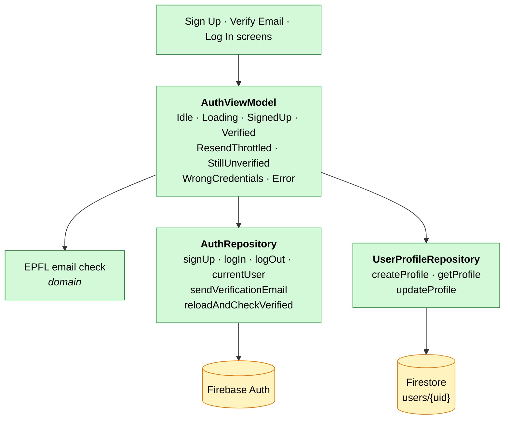

- **Result types (#30–#32).** `signUp` returns success, invalid domain, already in use or network error. `logIn` adds wrong credentials. `sendVerificationEmail` has a distinct *throttled* failure for Firebase's too-many-requests error, which the UI shows differently from a real error.
- **Profile (#34).** `UserProfile` has at least `uid`, `email` and `createdAt`. #45 adds `accountType` (`student` or `association`, default `student`) and `isAssociationVerified` (default `false`). The document ID is always the Auth UID, never a client-generated ID. The profile is created **exactly once, at the first verified entry** (Verify Email "Continue", or app-start routing finding a verified user without a profile), because the Security Rules only allow writes from verified accounts. If account creation fails, no profile is written. If the profile write fails, the user sees an error state. Fields other students may see live in a separate `publicProfiles/{uid}` document (see [5.2](#52-collections-and-key-fields)).
- **Email verification.** Every student account must have a verified `@epfl.ch` email, and the Security Rules check this whatever the sign-in method. **Associations** have no EPFL email, so they sign up with their own verified email, and they get no access beyond their own `users/{uid}` until a PolySocial admin verifies them (decision 11). Sprint 1 uses email/password, where Firebase marks the email unverified until the student clicks the link we send, hence the Verify Email screen. Google or Microsoft sign-in, if added later, deliver already-verified emails, so those users would skip that screen. The rules would not change.
- **Log out (#8, #32).** Logging out clears the session, and the next launch routes to Log In.

### 3.2 Map (Sprint 1)

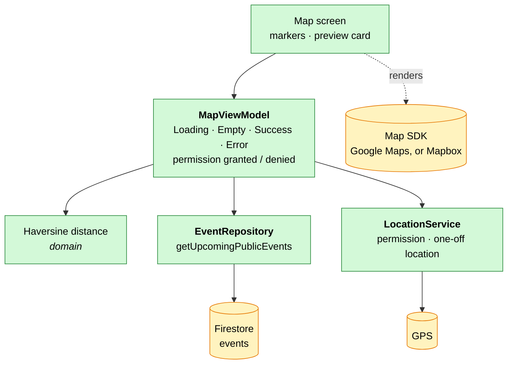

- **Map (#50, #51).** The map is centred on Lausanne. Location permission is requested once, on first entry to the Map tab. If it's denied, the map stays fully usable without distance badges. Distance is labelled *straight-line*, not walking time. Route-based distances are out of scope.
- **Upcoming events query (#49).** The query **must** include `isPrivate == false`. Security Rules are not filters, so a query that could return a private event is rejected as a whole. Combining equality on `isPrivate` with a range on `startTime` needs a composite index, which should be versioned in `firestore.indexes.json` next to the rules.

### 3.3 Create Event (Sprint 1)

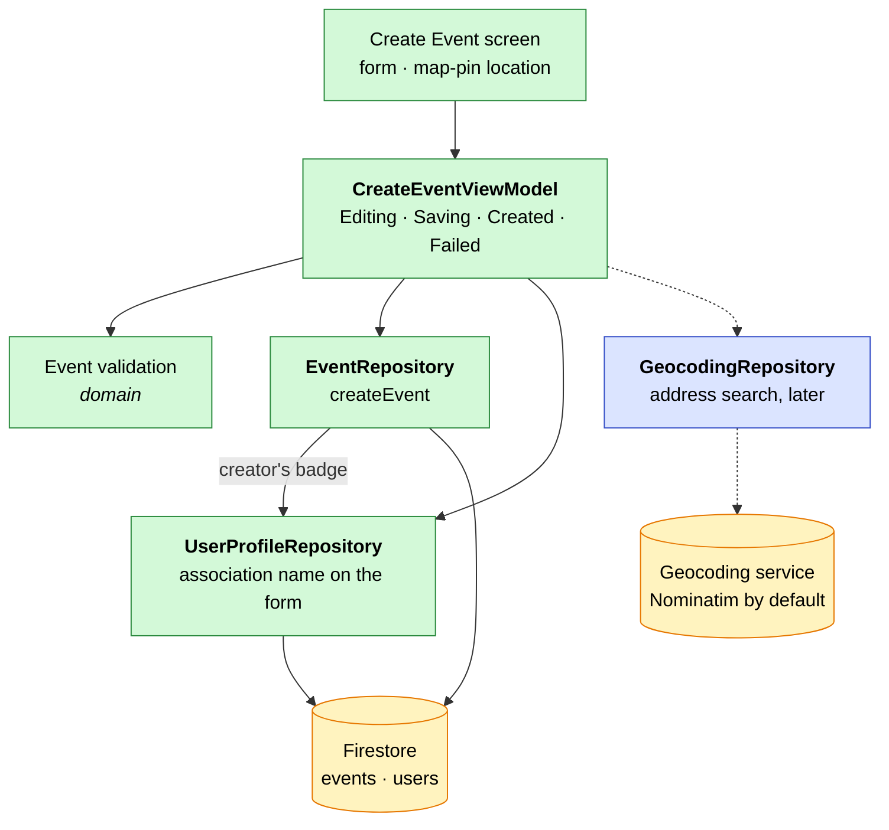

- **Event model (#45).** `id`, `title` (at most 80 characters), `description` (may be blank, at most 5000), `category` (Study, Sports, Culture, Party or Other; an unknown stored category reads as Other), `location` (lat/lng), `startTime`, `endTime` (nullable, after `startTime`), `capacity` (nullable, at least 2), `isPrivate`, `createdBy`, `organizerIds`, `allowedUids` and `isAssociationEvent`. `createdBy` is always the authenticated UID and is always in `organizerIds` and `allowedUids`. At creation the repository makes the creator the only organizer and allowed reader and sets `isAssociationEvent` from the creator's profile, ignoring the form's values. The Security Rules enforce this again (#47). An end time earlier than the start time on the form means the next day.
- **Create Event access (#46).** **Anyone can create an event** and becomes its **organizer**. An event can have one or several student organizers (`organizerIds`). Only a verified association (`accountType == "association"` and `isAssociationVerified`) publishes under its name: its events get `isAssociationEvent` and show a verified badge. An unverified association account can't create events or add members until it's verified, so the form has no access-denied state. Address search appears in the Figma task (#44), but the Sprint 1 build task only requires a map pin (#46), so geocoding stays blue. Its provider follows the map choice: Nominatim (approved in the API evaluation, with its usage policy) or Mapbox's own geocoding if we switch.
- **Create Event screen (#44, #46).** The form follows the Figma (section 04): a date with a start time and an **optional** end time, which tells check-in and "Find my group" when the event is over. An end time earlier than the start time means the next day, shown as "+1 day" under the end field (Figma "Create event · overnight"). Inline errors cover a missing title, a title over 80 characters, a description over 5000, a past date, an end time equal to the start time, a missing location and a capacity below 2, and the *Create* button stays disabled while they remain. Offline, `EventRepository.createEvent` returns `NetworkError` without starting a write (Firestore would queue it and never fail), and the ViewModel shows the error with *Try again*, keeping the form. If location access is denied, the location picker still works with search and the map pin.

### 3.4 Groups, matching and chat (Product Backlog)

- **Matching starts on the client.** Following the risk plan, matching starts as a simple deterministic heuristic in a pure Kotlin module and runs on the client. Group creation and joining go through a **Firestore transaction**, so two students can't take the last spot at the same time. We revisit a Cloud Function only if fairness or cheating becomes a problem. The module would move unchanged, and only the caller would change.
- **Real-time screens.** The matches list (#28) and chat (#25) use Firestore snapshot listeners exposed as `Flow`.
- **Chat type.** Each group gets a group chat. A one-to-one chat is simply a two-member group, so there is one chat model and one set of rules.
- **Moderation-ready.** Messages carry `senderId` and `createdAt`, and the rules are written per operation, so report/block and rate limiting can be added later without a rule rewrite.

### 3.5 At the venue and social features (Product Backlog)

- **Check-in (#22).** A one-off location check against the venue during the event window. A QR code at the entrance is the indoor fallback. Only checked-in members can upload to the album (README).
- **Find my group (#20).** Locations are shared **only with the group and only during the event** (README). Each member's position lives in `groups/{groupId}/locations/{uid}`. It is written only during the event window, readable only by group members, and deleted when the event ends. There is no location history.
- **Album.** Photos are compressed and resized on the device, then stored in Cloud Storage. A Firestore document holds each photo's metadata. Storage Security Rules enforce size and type limits and check-in membership. Thumbnails are cached.
- **Reminders (#21, #36).** WorkManager schedules them when the student registers, so they fire offline and survive reboots. The notification permission (Android 13+) is requested at that moment.
- **QR codes (#17, #22).** Scanned with CameraX + ML Kit barcode scanning. Payloads are typed strings such as `polysocial://checkin/{eventId}/{token}` and `polysocial://friend/{uid}`, validated by a pure parser.

## 4. Key flows

Each flow shows who calls whom, top to bottom. "App" is the screen together with its ViewModel.

### 4.1 Sign up (#30)

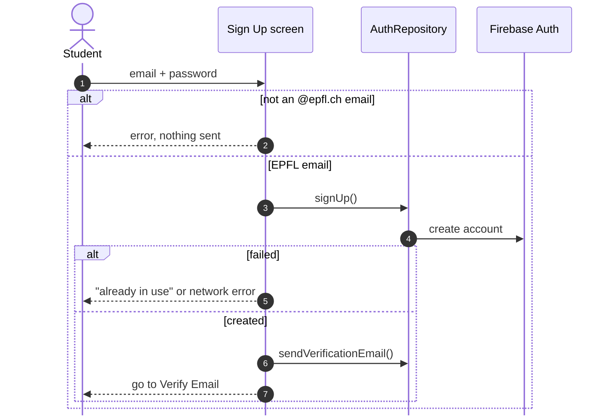

No profile is written yet. The Security Rules only accept writes from verified accounts.

### 4.2 Verify email, then create the profile (#31, #34)

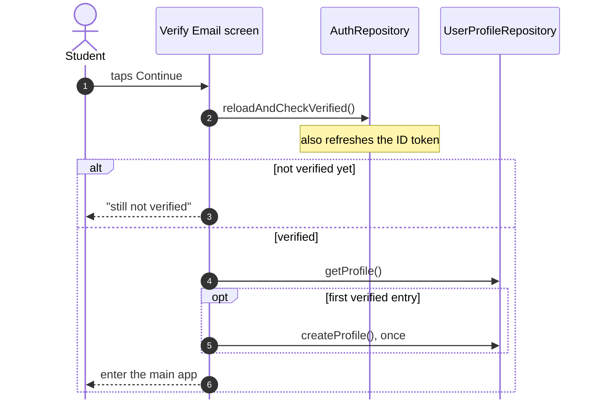

### 4.3 App start routing (#32)

### 4.4 Map: public events and distances (#49–#51)

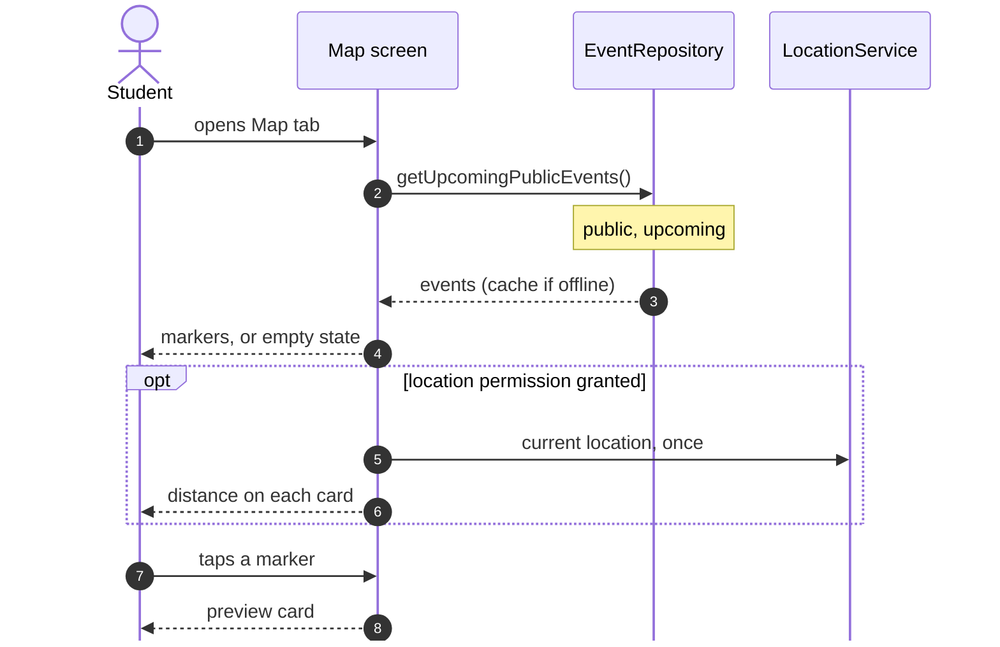

### 4.5 Find a group (Product Backlog, proposal)

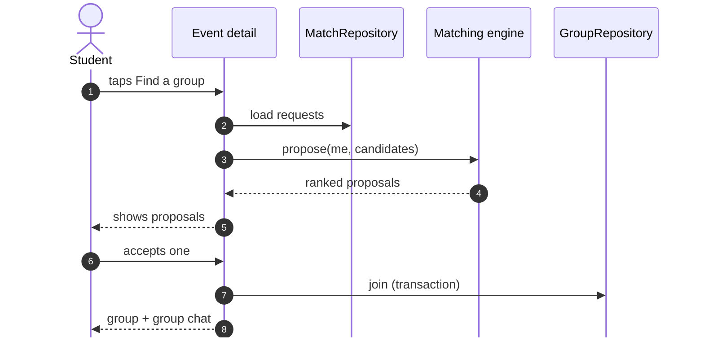

## 5. Data model

### 5.1 How the collections relate

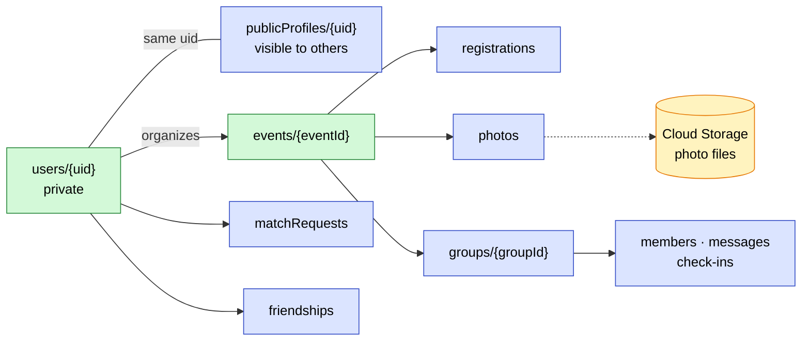

### 5.2 Collections and key fields

| Collection | Key fields | Status |
|---|---|---|
| `users/{uid}` | `uid`, `email`, `createdAt`, `accountType`, `isAssociationVerified` | 🟩 #34, #45 |
| `events/{eventId}` | `title`, `description`, `category`, `location`, `startTime`, `endTime?`, `capacity?`, `isPrivate`, `createdBy`, `organizerIds`, `allowedUids`, `isAssociationEvent` | 🟩 #45 |
| `publicProfiles/{uid}` | `username`, `displayName`, `section`, `year`, `interests` (always visible), `visibility` (public or private), `bio` | 🟦 new issue |
| `events/{id}/registrations/{uid}` | `registeredAt` | 🟦 #18 |
| `matchRequests/{id}` | `eventId`, `fromUid`, `toUid`, `status` | 🟦 #26, #27 |
| `groups/{groupId}` + `members`, `messages`, `checkIns` | `eventId`, `capacity` · `senderId`, `text`, `createdAt` · `method` (gps or qr). A one-to-one chat is a two-member group | 🟦 #14, #22, #25 |
| `groups/{groupId}/locations/{uid}` | position, `updatedAt`. Only during the event, deleted after | 🟦 #20 |
| `friendships/{id}` | `uidA`, `uidB`, `status` | 🟦 #16 |
| `events/{id}/photos/{photoId}` | `storagePath`, `uploaderId`, `createdAt`. The file itself is in Cloud Storage. | 🟦 album |

**Profiles are split, Instagram-style.** `users/{uid}` is private to its owner. `publicProfiles/{uid}` is what other students see. Section, year and interests are always visible because matching needs them. A **public** profile also shows friends, events attended, photos and the full bio to everyone. A **private** profile shows those only to approved connections.

## 6. Security Rules

Rules live in `firebase/firestore/firestore.rules` and are tested against the Firebase Local Emulator Suite. **Today** it denies everything by default except each account's own `users/{uid}` (#35); every other collection gets its own rule.

| Collection | Read | Create | Update / delete | Issue | Status |
|---|---|---|---|---|---|
| *every rule* | requires `isEpflUser()`: signed in, `email_verified == true`, email ends with `@epfl.ch` | | | #33 | 🟩 S1 |
| *association branch* | a verified association (`email_verified == true`, `accountType == "association"`, `isAssociationVerified` set by an admin), **only** on its own association, members and events. Added with its first use, after #35 removed the catch-all rule | | | #47 | 🟩 S1 |
| `users/{uid}` | own document only | own document only | own document only | #35 | 🟩 S1 |
| | **Only exception to *every rule*:** any account with a verified email reaches its own `users/{uid}`, but never sets `isAssociationVerified` (create or update), and can't change `uid` (which must match the document ID) or `accountType` after creation. That is all an unverified association can reach | | | #35 | 🟩 S1 |
| `events/{id}`, public | any EPFL user | any EPFL user or verified association, `createdBy == auth.uid` and in `organizerIds`. `isAssociationEvent` only for a verified association | organizers only | #47, #52 | 🟩 S1 |
| `events/{id}`, private | `auth.uid in allowedUids` (organizers, members, approved match requesters) | as above | organizers only | #52, #23 | 🟩 S1 |
| `publicProfiles/{uid}` | any EPFL user. Fields beyond the public set only for public profiles or approved connections | owner only | owner only | new issue | 🟦 PB |
| `groups/**`, `messages` | group members only | members, rate-limit ready | sender only | #25 | 🟦 PB |
| `matchRequests` | sender and recipient | sender | recipient responds | #26, #27 | 🟦 PB |
| Storage `events/{id}/album/**` | event group members | checked-in members, size and type limits | uploader | album | 🟦 PB |

Every PR that changes rules follows the process in `AGENTS.md`: "Changes Security Rules" in the description, allowed and denied emulator tests, and explicit reviewer sign-off.

## 7. Design decisions

Decided by the team on 2026-10-03, with 13 and 14 revised on 2026-10-04 after review, and 5 and 11 revised on 2026-10-06. The issues are being updated to match.

| # | Topic | Decision |
|---|---|---|
| 1 | Profile creation | Exactly once, at the first verified entry (Verify Email "Continue" or app start), because the rules only accept verified accounts |
| 2 | Who creates events | Anyone. The creator becomes the organizer, and an event can have several organizers. Verified associations get a badge |
| 3 | Profiles | Private `users` plus `publicProfiles`, with public or private visibility. Section, year and interests are always visible |
| 4 | Private events | `allowedUids` access list, checked by the rules |
| 5 | Create Event entry | "+" button on the Events and Map tabs. Afterwards, an "Event created" confirmation with *View event* and *Back to map*, as in the Figma (changed on 2026-10-06) |
| 6 | Matching | On the device: a pure module plus a Firestore transaction. Cloud Functions only if fairness or cheating becomes a problem |
| 7 | Find my group | `groups/{id}/locations/{uid}`, only during the event, members only, deleted afterwards |
| 8 | Reminders | WorkManager, scheduled at registration. Notification permission asked then |
| 9 | QR codes | CameraX + ML Kit. Typed `polysocial://checkin/…` and `polysocial://friend/…` payloads, pure parser |
| 10 | Section-exclusive events | Deferred. Later `allowedSections` on events, checked in the rules |
| 11 | Association verification | Associations have no EPFL email and sign up with their own. A PolySocial admin verifies them by hand (`isAssociationVerified` in the Firebase console, documented in the README); no access before that, except their own `users/{uid}`. Once verified, an association only sets up its association, manages its members and their roles, and publishes and manages its own events (no student profiles, groups, chats or matching). In-app admin flow later, not a current priority (changed on 2026-10-06) |
| 12 | One-to-one chat | A two-member group (one chat model) |
| 13 | Dependency injection | **Hilt** (changed after review). It is Android's recommended DI library, scales as repositories grow, and Hilt test modules swap in the fakes cleanly. The cost is some setup and slower builds |
| 14 | Back button | At a non-home tab root, go to the Events tab. At the Events root, exit. This is Android's standard pattern (changed after review) |

**Open questions** (add new ones here and in `CONTEXT.md`):
- **Map provider:** keep Google Maps or switch to Mapbox, as the coaches recommended? It affects the map SDK, the API key setup and the geocoding service.
- **Sign-in providers:** add Google or Microsoft sign-in next to email/password? EPFL addresses are Microsoft accounts, so Microsoft sign-in would prove EPFL membership directly. Either way, the rules keep requiring a verified `@epfl.ch` email for students.
- **Association members and event drafts:** Figma has them, but there is no data model yet. How does an association find and add a student as a member, and what can each role do? Drafts are not in the `Event` model.
- **Events without an end time:** `endTime` is optional, but check-in and Find my group only work during the event. Which time window applies when it is not set?
- **Place name:** the Create Event form shows the picked place's name, but the event stores only coordinates. Should it also store a place name or address?

## 8. Backlog traceability

Every Scrum Board item mapped to the components it touches.

Show the table (every Scrum Board item → components)

| Item | Epic | Components | Status |
|---|---|---|---|
| #6 Sign up, #5 | Authentication | Sign Up screen, AuthViewModel, AuthRepository, email validation | 🟩 via #29, #30, #33 |
| #7 Log in | Authentication | Log In screen, app-start routing, AuthRepository | 🟩 via #29, #32 |
| #8 Log out | Authentication | Profile tab, AuthRepository.logOut | 🟦 (logOut built in #32) |
| #9 Data binding | Authentication | UserProfileRepository, `users/{uid}`, rules | 🟩 via #34, #35 |
| #37 Bottom navigation | App Shell | navigation, app bar | 🟩 via #41 |
| #38 Scroll position kept | App Shell | per-tab back stacks | 🟩 via #42 |
| #39 Back navigation | App Shell | per-tab back stacks | 🟩 via #42 |
| #40 Placeholder state | App Shell | shared Loading / Empty state | 🟩 via #43 |
| #12 Event creation | Event Creation | Create Event screen, CreateEventViewModel, EventRepository.createEvent, rules | 🟩 via #44–#47 |
| #10 Browse events, #11 | Event Discovery | Map tab, MapViewModel, getUpcomingPublicEvents, LocationService, distance | 🟩 via #48–#51 |
| #23 Hide private events | Event Discovery | `isPrivate`, query filter, events read rule | 🟩 via #49, #52 |
| #13 Filter events | Event Discovery | Events tab, event filtering (domain) | 🟦 |
| #18 List of chosen events | — | My events, registrations, EventRepository | 🟦 |
| #36 Offline registered events | — | Firestore offline cache, My events | 🟦 |
| #19 Section-exclusive event | — | later: `allowedSections` on events, checked in rules | ⬜ deferred |
| #14 Group for an event | Groups & Matchmaking | Find a group, MatchingViewModel, matching engine, GroupRepository | 🟦 |
| #24 Match students together | Groups & Matchmaking | matching engine (domain) | 🟦 |
| #26 Accept or decline match | Groups & Matchmaking | proposals screen, MatchRepository | 🟦 |
| #27 Match with other students | Groups & Matchmaking | Match button, MatchRepository | 🟦 |
| #28 Real-time list of matches | Groups & Matchmaking | Profile matches list, snapshot listener | 🟦 |
| #15 Ping friends | Groups & Matchmaking | FriendRepository, notifications | ⬜ |
| #25 Chat | Chat | Chats tab, ChatViewModel, ChatRepository, `messages` | 🟦 |
| #16 Adding friends | — | Friends screen, FriendRepository, `username` | 🟦 |
| #17 Meeting people by QR | — | QrScanner, QR payload parsing, FriendRepository | 🟦 |
| #22 Automatic check-in | — | check-in policy, LocationService, QR fallback, GroupRepository | 🟦 |
| #20 Find my group | — | group venue map, `groups/{id}/locations` | 🟦 |
| #21 Event notification | — | ReminderScheduler, local notifications | 🟦 |
| #1, #53, #55 | — | project setup, PR template, CI. No product architecture impact | — |

